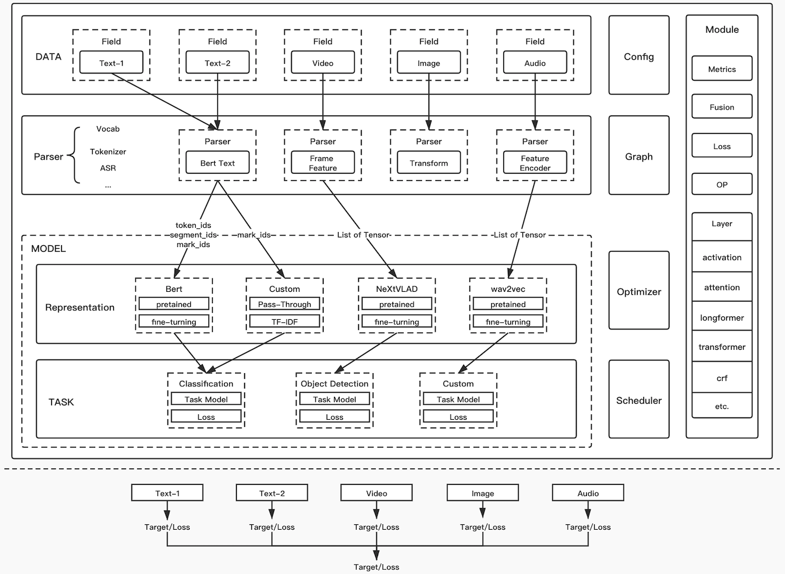
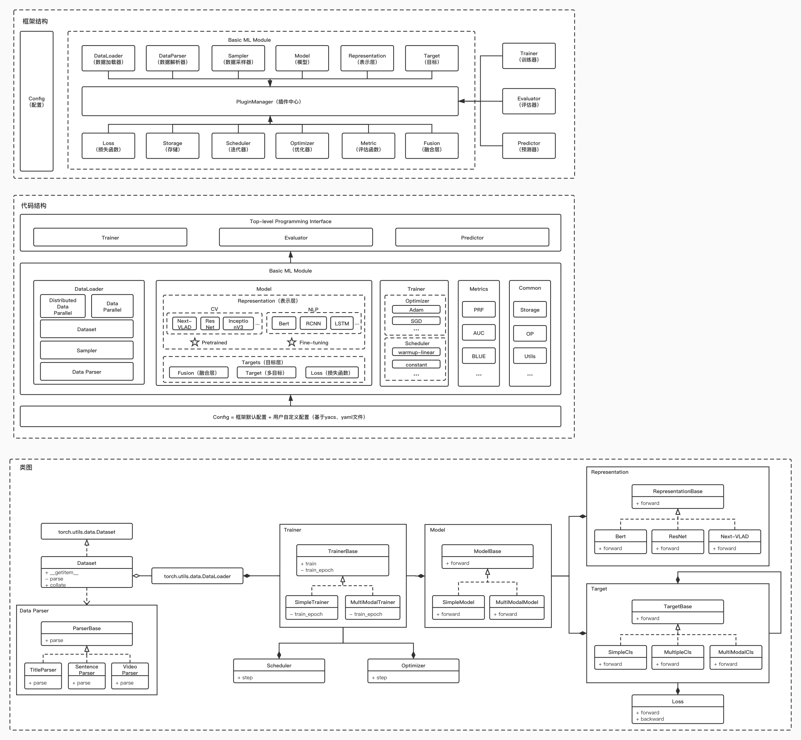

## 设计图



## 代码结构
```
├── lichee                                          # 主框架
│   ├── __init__.py
│   ├── train.py
│   ├── eval.py
│   ├── predict.py
│   ├── plugin.py
│   ├── dataset                                     # 数据集处理包
│       ├── dataloader                                # dataloader插件
│       ├── io_reader                                      # 数据标准读取插件
│       └── field_parser                                  # field解析插件                              
│   ├── config                                      # 配置解析（基于yacs开发）
│       ├── _base_                                      # 基础配置
│           ├── datasets                                    # 数据基础配置
│               └── dataset.yaml                             
│           ├── models                                      # 模型基础配置
│               └── model.yaml                               
│           ├── runtimes                                    # 运行环境基础配置
│               └── runtime.yaml                             
│           └── training                                     # 训练基础配置
│               └── training.yaml                             
│       └── config.py                                   # 配置类
│   ├── core                                        # 核心库
│       ├── trainer                                       # 训练器
│       ├── evaluator                                   # 评估器
│       └── predictor                                   # 预测器
│   ├── utils                                       # 模型格式转换
│       ├── converter                                   # 模型格式转换插件
│       ├── model_loader                             # 模型预测插件
│       ├── storage                                      # 文件存储插件
│       ├── tfrecord                                     # tfrecord实现
│       └── ...                             
│   ├── module                                  # 模块实现
│       ├── torch
│              ├── layer
│              ├── optimizer
│              ├── scheduler
│              ├── metrics
│              ├── loss
│              └── op
│       └── tensorflow
│   ├── model                                     # 模型实现
│       ├── model_base.py                            
│       ├── torch                                         # torch模型实现
│           ├── model_standard.py                        # 标准实现
│           └── ...
│       └── tensorflow                                # tf模型实现
│   ├── representation                            # 表示层实现
│       ├── representation_base.py                             
│       ├── torch                                         
│           ├── bert.py 
│           └── ...
│       └── tensorflow                                  
│   ├── task                                      # 目标实现
│       ├── torch                                       
│           ├── simple_classification.py 
│           ├── sequence_label.py 
│           └── ...
│       └── tensorflow                                         
├── configs                                         # 常用模型训练配置
│   ├── mix_grained_bert_single_classification          # 单标签分类任务
│   ├── mix_grained_bert_multi_classification           # 多标签分类任务
│   └── ...
├── examples                                      # 示例
├── tests                                             # pytest脚本
├── docs                                             # markdown文档
├── resources                                      # 资源文件
├── runtimes                                       # 训练平台运行脚本
├── setup.py                                        
├── README.md                                        
└── requirements.txt                                
```

## 架构图

